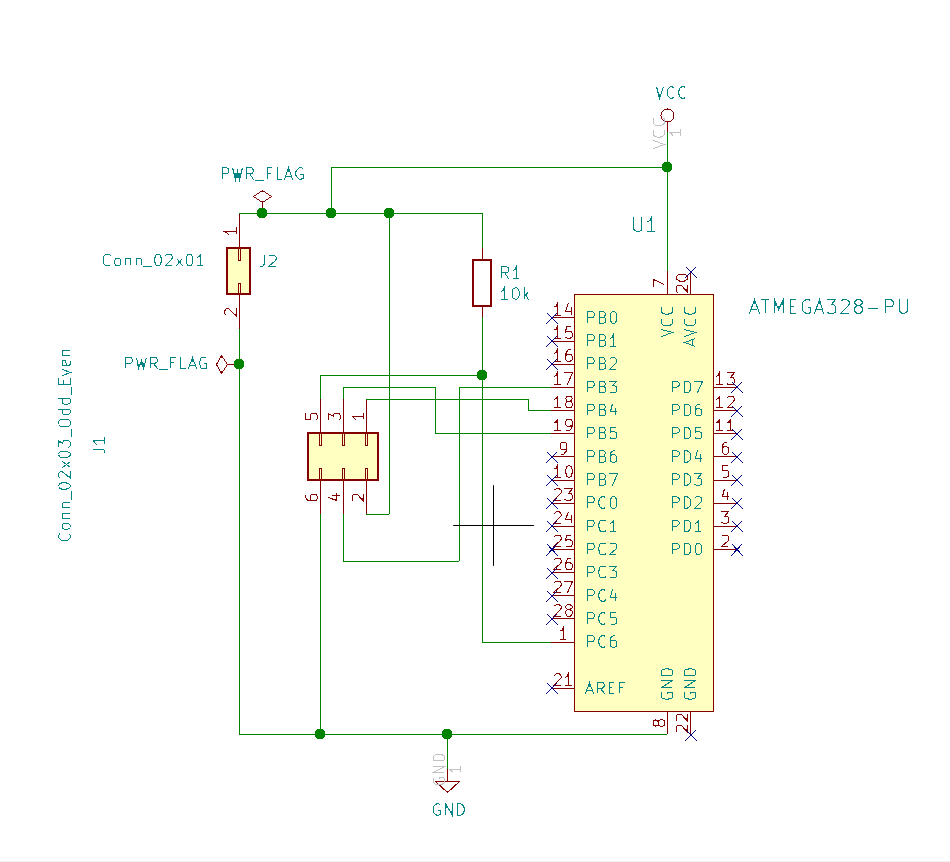

# AVR-ISP-Programmer-Board
## Purpose
The purpose of this project is to create a small, easy to use printed circuit board for programming
an ATmega328p microcontroller.

*Figure 1: The Final Product*
## Requirements
The board must meet the following requirements
* Have a socket allowing for the placement and removal of the microcontroller
* Have a connector allowing the direct use of the Waveshare USB AVRISP XPII programmer
* Have a connector to provide power to the microcontroller and programmer
* Not require any wires or jumpers other than those listed as required
* Be small
* Be easy to assemble

## Resources

### Software
The KiCad printed circuit board software suite will be used to design the circuit board.

### Equipment
A soldering iron (and solder) is required to build to board.

### Components
Components will be ordered from Digi-Key, and can be found in the Bill of Materials.

### Manufacturing
OSH Park will be used to manufacture the board.

## The Circuit Design
The microcontroller requires power, so VCC (pin 7) and GND (pin 8) will be connected to the board power connector. To keep the microcontroller powered on, a 10k pull-up resistor will be connected to RESET (pin 1). The pull-up resistor will pull RESET to VCC.

The programmer requires six connections: VCC and GND of the microcontroller; RESET of the microcontroller; and finally MISO (pin 18), MOSI (pin 17), and SCK (pin 19) of the microcontroller.

Figure 2 shows the circuit design. The design simply connects every pin to wherever it needs to be, as well as labels the input voltage and ground.

*Figure 2: Circuit Schematic in Eeschema*

### Eeschema
The circuit schematic was designed in Eeschema from the KiCad suite. The microcontroller socket is the ATMEGA328-PU model from the Digi-Key KiCad library available at [github.com/Digi-Key/digikey-kicad-library](https://github.com/Digi-Key/digikey-kicad-library). The power and programmer connector models are from the Connector_Generic library.

## The PCB Design
The PCB was designed in Pcbnew using the netlist exported by Eeschema. With the netlist imported, it was simply a matter of matching all of the nets. Because size is an important factor, objects were placed in an effort to maximize area effieciency. The size of each component was considered to ensure that everything would fit on the board, with some extra room to ensure fit and soldering ease.
