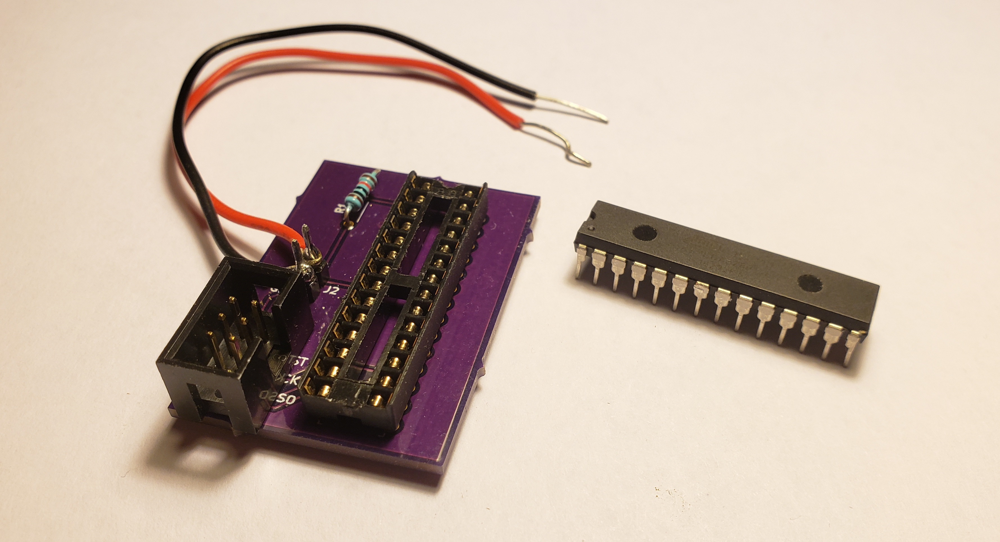

# AVR-ISP-Programmer-Board
## Purpose
The purpose of this project is to create a small, easy to use printed circuit board for programming
an ATmega328p microcontroller.

*Figure 1: The Final Product*
## Requirements
The board must meet the following requirements
* Have a socket allowing for the placement and removal of the microcontroller
* Have a connector allowing the direct use of the Waveshare USB AVRISP XPII programmer
* Have a connector to provide power to the microcontroller and programmer
* Not require any wires or jumpers other than those listed as required
* Be small
* Be easy to assemble

## Resources

### Software
The KiCad printed circuit board software suite will be used to design the circuit board.

### Equipment
A soldering iron (and solder) is required to build to board.

### Components
Components will be ordered from Digi-Key, and can be found in the Bill of Materials.

### Manufacturing
OSH Park will be used to manufacture the board.

## The Circuit Design
The microcontroller requires power, so VCC (pin 7) and GND (pin 8) will be connected to the board power connector. To keep the microcontroller powered on, a pull-up resistor will be connected to RESET (pin 1). The pull-up resistor will pull RESET to VCC.

The programmer requires six connections: VCC and GND of the microcontroller; RESET of the microcontroller; and finally MISO (pin 18), MOSI (pin 17), and SCK (pin 19) of the microcontroller. 
